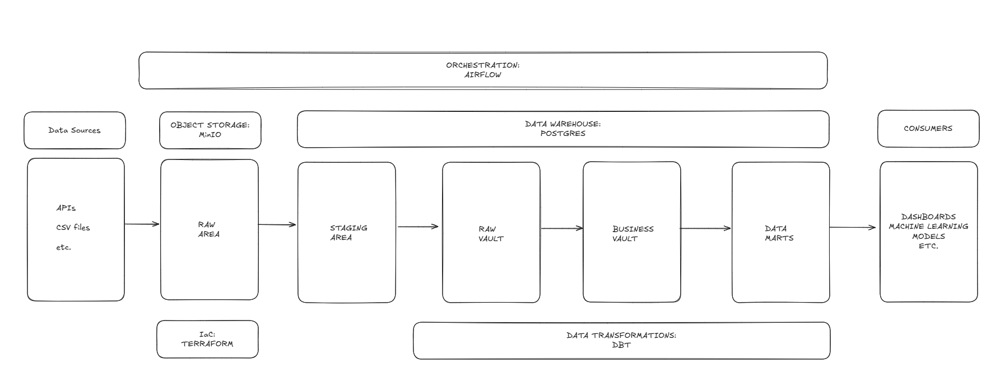

# STOCK_RESEARCH_DATA_WAREHOUSE

## Overview

This project is currently in a very early stage.

This project has three main goals: It serves to showcase my skills as a data engineer in my portfolio; Allows me to get hands-on experience with technologies and frameworks that I have not yet had the chance to use professionally but am interested in; Once developed enough, it might aid me in doing my research to identify potential good investments.

## Architecture Diagram



## Tech Stack

- Orchestration: Airflow (Astronomer's distro)
- Object Storage: MinIO (S3 compatible)
- Infrastructure as Code: Terraform
- Data Warehouse: Postgres
- Data Modeling: Data Vault 2.0
- Data Transformation: DBT (Data Build Tool)
- Dependency Management: UV
- Python 3.12

## Setup Instructions

### Prerequisites
- Python 3.12
- Docker & Docker Compose
- Terraform
- MinIO
- Postgres

### Installation and Local Environment Setup
```bash
# Clone the repository
$ git clone https://github.com/jpedropereira/stock_research_data_warehouse.git
$ cd stock_research_data_warehouse

# Install Python using uv
uv python install 3.12
uv python pin 3.12

uv venv
source .venv/bin/activate

# Install dependencies
uv sync --all-extras --dev
```

### Infrastructure Setup
```bash
# Initialize and apply Terraform scripts
$ cd stock_market_research_data_warehouse/terraform
$ terraform init
$ terraform apply
```

You can see existing buckets and user credentials (needed to create the Airflow connection to MinIO) by running the following commands:

```bash
# See your buckets
terraform output bucket_names

# Get the user credentials (you'll need these for Airflow)
terraform output -json user_credentials
```


### Running Airflow Locally
```bash
cd stock_market_research_data_warehouse
astro dev start
```

## Usage
- Trigger Airflow DAGs via the Airflow UI
- Use DBT for data modeling and transformations
- Manage infrastructure with Terraform

## Configuration
- Environment variables used by the containers should be kept in `,env.local` file due to Astro's requirements. A `.env.local.example` file is provided to aid its configuration.
- Project environment variables should be kept under `.env` file. A `.env.example` file is provided to aid its configuration.
- MinIO and Postgres connections details in Airflow need to be added. A `airflow_settings.yaml.example` file is provided as template.
- Customize MinIO, Postgres, and Airflow settings as needed

## Testing
```bash
$ pytest stock_market_research_data_warehouse/tests
```

## Troubleshooting
- Check logs for Airflow, Docker, and Terraform errors

## License
This project is licensed under the MIT License. See the LICENSE file for details.

## Contact
Maintainer: João Pereira ([GitHub](https://github.com/jpedropereira))

## References
- [Airflow Documentation](https://airflow.apache.org/docs/)
- [Astro CLI Documentation](https://docs.astronomer.io/astro/cli)
- [Terraform Documentation](https://www.terraform.io/docs)
- [MinIO Documentation](https://min.io/docs/)
- [DBT Documentation](https://docs.getdbt.com/)
- [Postgres Documentation](https://www.postgresql.org/docs/)

## Pre-commit Hooks
This project uses [pre-commit](https://pre-commit.com/) to automate code quality checks before commits.

### Installation
```bash
# Install the git hooks defined in .pre-commit-config.yaml
pre-commit install
```

After installation, pre-commit will automatically run checks on staged files before each commit.

## Dependency Management: uv vs pip

For local development, [uv](https://github.com/astral-sh/uv) is used to install Python packages due to its fast installation benefits. However, when building the Docker container, using uv directly can cause conflicts with Astro (Astronomer) images. To avoid this, uv is used to generate a `requirements.txt` file with all dependencies, and then `pip` is used inside the container to install them:

```bash
# Locally
uv sync --all-extras --dev

# In Dockerfile (container build)
pip install -r requirements.txt
```

This ensures compatibility with Astro while maintaining fast installs during local development.

## Windows Users: WSL2 Requirement
If you are using Windows, you should use [WSL2](https://learn.microsoft.com/en-us/windows/wsl/) (Windows Subsystem for Linux) for development. Airflow does not run natively on Windows, so WSL2 is required to run Airflow and execute tests reliably.
